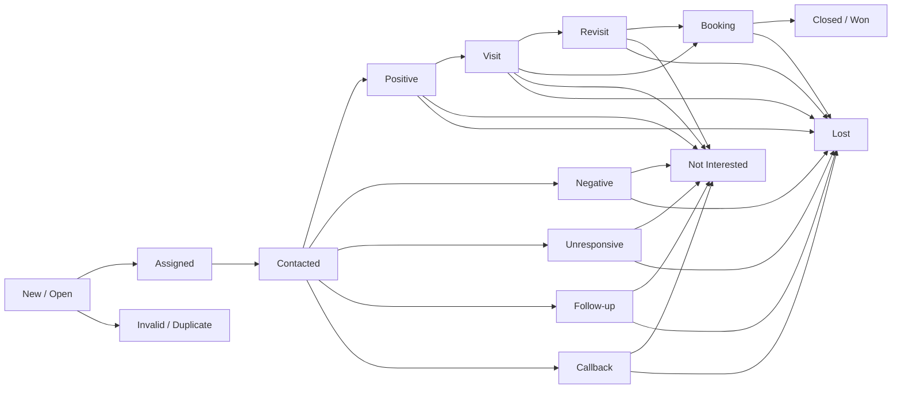
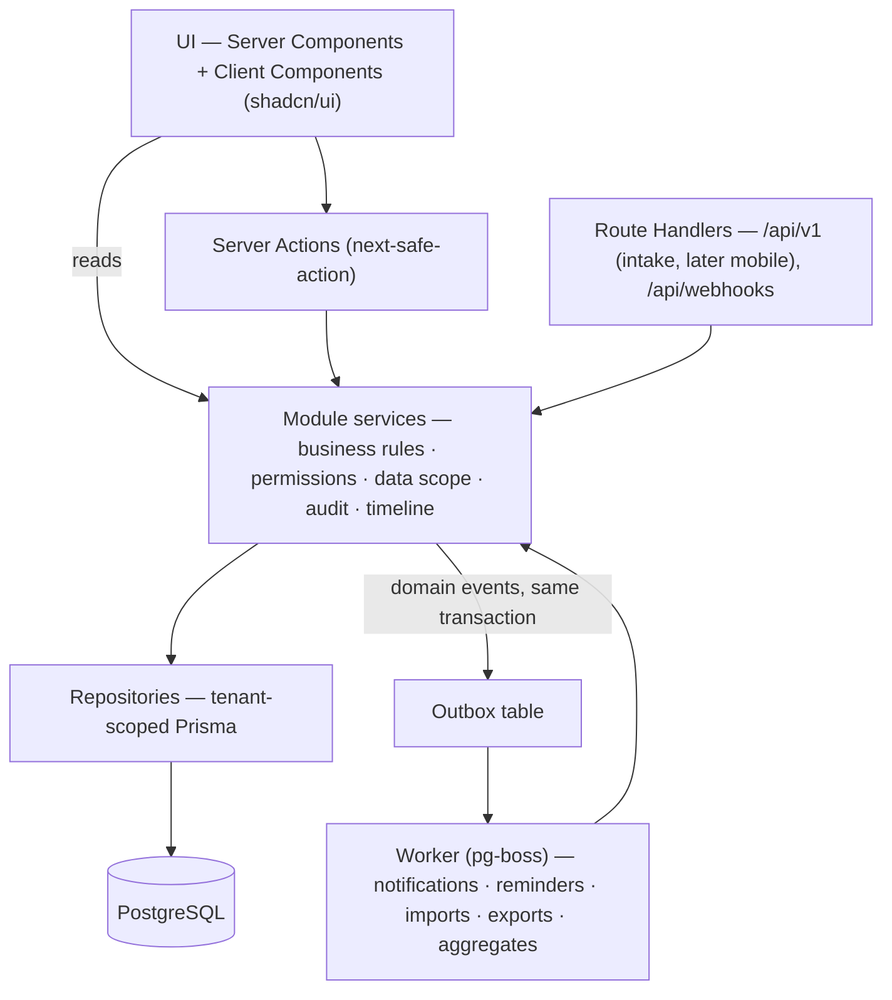
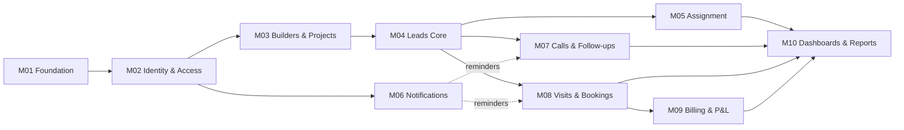

# Builder Channel CRM — Build Plan

| | |
|---|---|
| **Source document** | *Real Estate Channel Partner CRM — General System Requirements* (PRD, 32 sections) |
| **Plan version** | 1.0 |
| **Created** | 2026-09-24 |
| **Target** | Web application only (mobile app is **out of scope**), single real-estate channel partner today, **multi-tenant ready** for tomorrow |
| **Stack** | Next.js (App Router) · TypeScript · PostgreSQL · Prisma · Better Auth · Tailwind + shadcn/ui |
| **Progress tracker** | [`PROGRESS.md`](./PROGRESS.md) — module status, change log, decisions, open questions |

> **How to use this file**
> - This file is the **source of truth for the build tasks**. Tick a checkbox (`- [x]`) when a task is merged.
> - Build the modules **in order (M01 → M10)**. Each module has a goal, scope, data model, screens, rules, checklist and acceptance criteria.
> - Every task has an ID (e.g. `M04-12`). Use it in commit messages and in `PROGRESS.md` change log entries.
> - When a module's checklist and acceptance criteria are complete, mark it **Done** in `PROGRESS.md`.

---

## Table of Contents

1. [PRD Analysis](#1-prd-analysis)
2. [Architecture](#2-architecture)
3. [Module Roadmap](#3-module-roadmap)
4. [Module Details & Checklists](#4-module-details--checklists)
   - [M01 — Project Foundation & Platform Core](#m01--project-foundation--platform-core)
   - [M02 — Identity, Access Control & Team Structure](#m02--identity-access-control--team-structure)
   - [M03 — Builder & Project Management](#m03--builder--project-management)
   - [M04 — Lead Management Core](#m04--lead-management-core)
   - [M05 — Lead Assignment, Reassignment & Team Workload](#m05--lead-assignment-reassignment--team-workload)
   - [M06 — Notifications & Reminders Engine](#m06--notifications--reminders-engine)
   - [M07 — Calls, Follow-ups & Callbacks](#m07--calls-follow-ups--callbacks)
   - [M08 — Site Visits, Revisits, Bookings & Closures](#m08--site-visits-revisits-bookings--closures)
   - [M09 — Billing, Commission & Profit/Loss](#m09--billing-commission--profitloss)
   - [M10 — Dashboards, Reports & Analytics](#m10--dashboards-reports--analytics)
5. [Future Phases (post v1)](#5-future-phases-post-v1)
6. [Risks & Mitigations](#6-risks--mitigations)

---

## 1. PRD Analysis

### 1.1 Product summary

A centralized CRM for a **real-estate channel partner** (a brokerage that sells projects of many builders). It tracks every
lead from first enquiry to final outcome (booking/closure, lost, not interested, invalid), keeps a complete, attributable
history of every action, and gives Admins, Managers and Executives role-appropriate dashboards and reports — including
financial results (billing, profit & loss).

**Core business flow (PRD §31)** — the module order below mirrors it:

```
Builders & projects maintained ─► Lead enters CRM ─► Manager assigns to Executive ─► Executive calls & records outcome
   ─► Follow-ups / callbacks scheduled ─► Site visits / revisits ─► Status progresses ─► Booking ─► Closure / other outcome
   ─► Manager monitors throughout ─► Management reviews activity, conversion, P&L via dashboards & reports
```

### 1.2 Actors & default access matrix

Three roles (PRD §3). Permissions are **configurable by Admin** (PRD §3, §26); the table shows the seeded defaults.
*Own* = leads assigned to the user · *Team* = leads of the manager's reporting tree · *All* = whole organization.

| Capability | Admin | Manager | Executive |
|---|---|---|---|
| Organization settings & master data | ✅ | ❌ | ❌ |
| Manage users, roles & permissions | ✅ | View own team | ❌ |
| Manage builders & projects | ✅ | View | View |
| View leads & history | All | Team | Own |
| Create leads | ✅ | ✅ | ✅ (configurable) |
| Edit leads / change status | All | Team | Own |
| Assign & reassign leads (with reason) | All | Team | ❌ |
| Calls, follow-ups, callbacks, visits | All | Team | Own |
| Bookings & closures | All | Team | Own |
| Dashboards | Organization | Team | Personal |
| Reports | All | Team | Own (limited) |
| Import / export leads | ✅ | Configurable | ❌ |
| Billing, commission, P&L | ✅ | Configurable (default ❌) | ❌ |
| Announcements & notification settings | ✅ | Receive | Receive |
| Audit log | ✅ | ❌ | ❌ |

### 1.3 Core domain entities

```
Organization (tenant)
 ├── Membership (User ↔ Organization, Role, reportsTo) ── User (global identity)
 ├── Builder ──< Project ──< ProjectConfiguration / Amenities / Files
 ├── Lead ──< LeadProjectInterest >── Project
 │     ├──< LeadAssignment (history)      ├──< LeadStatusHistory
 │     ├──< LeadNote / LeadFile           ├──< LeadActivity (timeline)
 │     ├──< CallLog (+ recording)         ├──< FollowUp (follow-up | callback)
 │     ├──< SiteVisit (visit | revisit)   └──< Booking ── DealFinancial ──< InvoiceLine >── Invoice ──< Payment
 ├── Masters: LeadSource, Campaign, LeadStatus, CallOutcome, VisitOutcome, LossReason, PropertyType, ...
 ├── Notification / ScheduledReminder / Announcement
 └── AuditLog / OutboxEvent / FileObject / Sequence
```

### 1.4 Lead lifecycle (PRD §6)

Status **labels are configurable**; every status carries an immutable **system key** and a **category**, so business
logic, dashboards and reports never depend on display names.



| System key | Default label | Category | Set by | Terminal | Reason required |
|---|---|---|---|---|---|
| `NEW` | New / Open | OPEN | System on creation | No | – |
| `ASSIGNED` | Assigned | OPEN | System on assignment (M05) | No | – |
| `CONTACTED` | Contacted | ACTIVE | System on first connected call (M07) / manual | No | – |
| `POSITIVE` | Positive | ACTIVE | Call outcome (M07) / manual | No | – |
| `NEGATIVE` | Negative | ACTIVE | Call outcome / manual | No | – |
| `UNRESPONSIVE` | Unresponsive | ACTIVE | After N unanswered attempts / manual | No | – |
| `FOLLOW_UP` | Follow-up | ACTIVE | Follow-up scheduled (M07) / manual | No | – |
| `CALLBACK` | Callback | ACTIVE | Callback scheduled (M07) / manual | No | – |
| `VISIT` | Visit | ACTIVE | Visit scheduled/completed (M08) | No | – |
| `REVISIT` | Revisit | ACTIVE | Revisit scheduled/completed (M08) | No | – |
| `BOOKING` | Booking | BOOKING | Booking created (M08) | No | – |
| `CLOSED_WON` | Closed / Won | WON | Booking closed (M08) | Yes | – |
| `NOT_INTERESTED` | Not Interested | LOST | Manual / call outcome | Yes | ✅ |
| `LOST` | Lost | LOST | Manual / booking cancelled | Yes | ✅ |
| `INVALID` | Invalid / Duplicate | INVALID | Manual / duplicate detection | Yes | ✅ |

Reopening a terminal lead requires the `leads.reopen` permission and is recorded in history.

### 1.5 Scope decisions

| In scope (v1 — this plan) | Deferred / out of scope |
|---|---|
| Responsive **web app** (desktop, laptop, tablet — PRD §24) | **Mobile application (PRD §25)** — out of scope; service layer is API-ready (see [F2](#5-future-phases-post-v1)) |
| All PRD functional areas §3–§24, §26–§28 | Mobile push notifications, device call recording, offline, location (F2) |
| Manual call logging + call-recording upload + telephony **adapter interface** | Real cloud-telephony integration (F3) |
| Lead intake REST API (API key) + CSV/XLSX import | WhatsApp, SMS, portals, payment gateway, accounting sync, maps (F3) |
| Single organization at runtime, **multi-tenant data model from day one** | Tenant sign-up, subdomains, SaaS subscription billing, super-admin console, RLS (F1) |
| In-app + email notifications (web push optional) | |

### 1.6 Assumptions & glossary (to confirm — tracked as open questions in `PROGRESS.md`)

- **Revenue model:** the channel partner earns **commission/brokerage from builders** on closed bookings; P&L = commission revenue − deal costs (payouts, incentives, cashback) − other expenses. Rules are configurable (M09).
- **Defaults:** currency INR, timezone Asia/Kolkata, locale en-IN — all stored as **organization settings**, never hard-coded.
- **Hierarchy:** reporting lines via `reportsTo` (supports multi-level managers; single level is a special case).
- **Glossary** (metric definitions used by M05/M07/M10):
  - *Open lead* — status category OPEN, ACTIVE or BOOKING.
  - *Pending lead* — open lead with an overdue follow-up/callback **or** no next action scheduled.
  - *Unworked lead* — assigned lead with no activity since assignment for more than *N* hours (org setting).
  - *Overdue* — follow-up/callback/visit whose due time has passed and is not completed/cancelled.
  - *Positive/Negative/Unresponsive leads* — leads whose **current status** is in that state; *positive/negative/unresponsive calls* — calls whose **outcome category** is that value.

### 1.7 PRD traceability matrix

| PRD § | Topic | Module(s) |
|---|---|---|
| 1–2 | System overview, business objective | All (visibility delivered by M10) |
| 3 | System users (Admin, Manager, Executive) | M02 |
| 4 | Builder & project management | M03 |
| 5 | Lead management | M04 |
| 6 | Lead status & lifecycle | M04 (+ system transitions in M05, M07, M08) |
| 7 | Lead assignment & reassignment | M05 |
| 8 | Calling & call management | M07 |
| 9 | Follow-up & callback management | M07 (+ reminders M06) |
| 10 | Executive daily activities | M07 (agenda), M10 (My Day dashboard) |
| 11 | Visit & revisit management | M08 |
| 12 | Booking & closure management | M08 (+ financials M09) |
| 13 | Manager & team management | M02 (hierarchy), M05 (workload), M10 (dashboards/reports) |
| 14 | Admin management | M02, M03, M04, M06, M09, M10 |
| 15 | Dashboard & overview | M10 |
| 16 | Reports & analytics | M10 (+ financial reports M09) |
| 17 | Profit & loss | M09 (+ loss reasons M08) |
| 18 | Notifications | M06 (+ each module registers its types) |
| 19 | Billing | M09 |
| 20 | Login, access & security | M01 (baseline), M02 |
| 21 | Profile management | M02 (+ preferences M06, summary M10) |
| 22 | Lead history & activity timeline | M04 (framework) + every later module adds events |
| 23 | Search, filters & lead views | M04 (+ filters from M07, M08) |
| 24 | Web application | M01 (responsive shell) + all |
| 25 | Mobile application | **Out of scope** → F2 |
| 26 | System settings & master data | M01 (org), M02 (roles), M03, M04, M06, M07, M08, M09 |
| 27 | Data & document management | M01 (storage, backup), M03/M04 (files), M07 (recordings) |
| 28 | System accountability | M01 (audit infra), M02 (audit viewer), M04 (timeline) + all |
| 29 | Future & optional integrations | M04 (intake API, import), M07 (telephony adapter), F3 |
| 30 | General expectations (scalable, secure) | §2 Architecture, M01 |
| 31 | Overall business flow | Module order M03 → M10 |
| 32 | Scope understanding | §1.5, open questions |

---

## 2. Architecture

### 2.1 Technology stack

Versions are the latest stable at planning time; **pin exact versions in M01** and record them in `PROGRESS.md`.

| Layer | Choice | Why |
|---|---|---|
| Runtime | Node.js 22 LTS, pnpm | LTS, fast, strict dependency resolution |
| Framework | **Next.js 16 (App Router)**, React 19, TypeScript (strict) | Requested stack; RSC for data-heavy screens; Server Actions for mutations |
| UI | Tailwind CSS v4, shadcn/ui (Radix), lucide-react, sonner | Accessible, owned components, fast to build admin UIs |
| Tables & forms | TanStack Table, React Hook Form + Zod, nuqs (URL state) | Server-side pagination/filter synced to URL; shared validation |
| Client data | TanStack Query (only where polling/interactive: notifications, agenda) | Most reads happen in Server Components |
| Charts | Recharts | Dashboards & reports |
| Database | **PostgreSQL 16+** | Relational integrity, JSONB, `pg_trgm` search, future RLS for tenancy |
| ORM | **Prisma 7** (multi-file schema, pg driver adapter) | Type-safe queries, migrations, client extensions for tenant guard |
| Auth | **Better Auth** (email + password, DB sessions) | Self-hosted, password reset, rate limiting, organization-aware sessions |
| Mutations | next-safe-action | Typed actions with middleware (auth → tenant → permission → validation) |
| Background jobs | **pg-boss** (Postgres-backed queue) + separate worker process | Reminders, digests, imports, exports — no Redis needed |
| Files | S3-compatible storage (AWS S3 / Cloudflare R2; RustFS locally) | Presigned URLs, private buckets, tenant-prefixed keys |
| Email | React Email + provider adapter (SMTP / Resend); Mailpit locally | Transactional emails & digests |
| PDF / Excel | @react-pdf/renderer, exceljs | Invoices, report exports |
| Utilities | date-fns / date-fns-tz, decimal.js, libphonenumber-js, uuid (v7) | Timezones, money, phone normalization, sortable IDs |
| Testing | Vitest (unit + integration on real Postgres), Playwright (E2E) | Confidence per module |
| Quality | ESLint, Prettier, Husky, lint-staged, commitlint | Consistent codebase |
| Observability | pino (structured logs), Sentry (optional) | Diagnostics |
| CI/CD | GitHub Actions; Docker images (web + worker) | Host-agnostic deployment |

### 2.2 Architecture style — modular monolith

One Next.js application organized into **domain modules** with strict boundaries, plus a separate **worker process**
(same codebase) for background jobs. This keeps the build simple today and lets modules be extracted later if ever needed.



**Rules**

1. **Services are transport-agnostic.** Server Actions, Route Handlers, jobs and (future) mobile APIs all call the same service functions. Business logic never lives in components or actions.
2. **Every service call receives a context** `ctx = { user, membership, organizationId, permissions, scope }`.
3. **Modules talk to each other only via** (a) the public API exported from `modules/<name>/index.ts` and (b) **domain events**. No module writes another module's tables.
4. **Extension through registries** (built in M01): navigation, settings sections, permissions, lead-detail panels, timeline renderers, notification types, metrics, reports. A later module plugs into an earlier one without editing its internals — this is what keeps modules independent.
5. **Side effects are asynchronous and reliable:** the service writes the change + audit + timeline + outbox event in **one transaction**; the worker dispatches events to handlers (idempotent).

### 2.3 Folder structure

```
.
├── docs/
│   ├── adr/                        # Architecture Decision Records
│   └── runbooks/                   # backup & restore, deployment
├── prisma/
│   ├── schema/                     # multi-file schema — one file per module
│   │   ├── _base.prisma            # generator + datasource
│   │   ├── platform.prisma         # Organization, AuditLog, Sequence, OutboxEvent, FileObject
│   │   ├── identity.prisma         # M02
│   │   ├── catalog.prisma          # M03 builders & projects
│   │   └── ...                     # leads, assignment, notifications, activities, deals, finance, analytics
│   ├── migrations/
│   └── seed/
├── src/
│   ├── app/
│   │   ├── (auth)/                 # login, forgot/reset password
│   │   ├── (app)/                  # authenticated shell
│   │   │   ├── dashboard/  leads/  agenda/  visits/  bookings/
│   │   │   ├── builders/  projects/  team/  reports/  billing/
│   │   │   ├── notifications/  profile/  settings/
│   │   └── api/
│   │       ├── auth/[...all]/      # Better Auth handler
│   │       ├── v1/                 # external API (lead intake now, mobile later)
│   │       ├── webhooks/           # telephony / integrations (later)
│   │       └── health/
│   ├── modules/                    # business modules (M02–M10)
│   │   └── <module>/
│   │       ├── index.ts            # public API — other modules import only from here
│   │       ├── server/             # services, repositories, policies, event handlers, jobs
│   │       ├── actions/            # server actions (thin: validate → service)
│   │       ├── schemas/            # zod schemas shared by client & server
│   │       ├── components/         # module UI
│   │       └── register.ts         # nav, permissions, settings, notification types, timeline renderers
│   ├── platform/                   # cross-cutting core (M01)
│   │   ├── db/  tenant/  auth/  rbac/  audit/  events/  jobs/
│   │   └── storage/  email/  logger/  sequences/  errors/  actions/
│   ├── components/
│   │   ├── ui/                     # shadcn/ui primitives
│   │   └── shared/                 # DataTable, PageHeader, DateRangePicker, ...
│   ├── config/                     # env.ts, site config
│   ├── lib/                        # pure utilities (format, dates, money, phone)
│   ├── worker/                     # background worker entrypoint
│   └── proxy.ts                    # route protection (Next.js 16 proxy, formerly middleware)
├── tests/
│   ├── e2e/                        # Playwright
│   └── factories/                  # test data builders
├── docker-compose.yml  Dockerfile
└── BUILD_PLAN.md  PROGRESS.md  README.md  CLAUDE.md
```

Module folder names: `identity` (M02), `catalog` (M03), `leads` (M04), `assignment` (M05), `notifications` (M06),
`activities` (M07), `deals` (M08), `finance` (M09), `analytics` (M10).

### 2.4 Multi-tenancy strategy (future-proofing)

**Model: shared database, shared schema, tenant column.** Today there is exactly one organization; the code behaves as if
there could be many. Switching on multi-tenancy later (F1) must require **no data migration** and **no rewrite of modules**.

**Non-negotiable rules for every module**

| # | Rule |
|---|---|
| T1 | Every tenant-owned table has `organizationId` (NOT NULL, FK, indexed — usually the first column of composite indexes). |
| T2 | Unique constraints are per tenant: `@@unique([organizationId, code])`, never global (except `User.email`). |
| T3 | Feature code never uses the raw Prisma client. It uses the **tenant-scoped DB accessor** from `platform/db`; a Prisma extension guard throws (dev/test) if a tenant model is queried without an `organizationId` filter. ESLint `no-restricted-imports` enforces this. |
| T4 | The tenant comes from the **session's active organization** — never from request body/query params. |
| T5 | `User` is a global identity; access to an organization is a `Membership` (role, manager, status). A user can belong to several organizations in the future. |
| T6 | Settings are stored **per organization** (timezone, currency, locale, fiscal year, policies) — nothing business-specific is hard-coded. |
| T7 | Human-readable numbers (lead, booking, invoice) come from a **per-organization sequence**. |
| T8 | File storage keys are prefixed `orgs/{organizationId}/…`; downloads are authorized per tenant. |
| T9 | Background jobs, outbox events, cache keys and log lines always carry `organizationId`. |
| T10 | Integration tests create **two organizations** and assert that no data leaks across them. |

**Today (v1):** seed one organization; the active organization is resolved from the membership in the session; no org switcher UI.
**Later (F1):** tenant sign-up & onboarding, subdomain/custom-domain resolution in `proxy.ts`, org switcher, platform
super-admin console, PostgreSQL **Row-Level Security** as defense-in-depth, per-tenant plans/limits & SaaS billing.

### 2.5 Access control model

- **Permissions** are string keys declared by each module (e.g. `leads.view`, `leads.reassign`, `billing.manage`) and grouped in the permission catalogue.
- **Roles** (per organization) hold a set of permissions; `Admin`, `Manager`, `Executive` are seeded system roles; Admin can edit them and create custom roles (e.g. *Accounts*).
- **Data scope** — for record-level access each role gets a scope per resource: `OWN` (assigned to me), `TEAM` (me + my reporting tree), `ALL` (organization). The scope resolver returns a Prisma `where` fragment applied in every repository query.
- **Enforcement is server-side** in services. UI gating (`<Can>`, permission-aware navigation) is for usability only.
- **Field-level protection** for financial data (booking value, commission, P&L) via dedicated permissions.

### 2.6 Cross-cutting conventions

| Concern | Convention |
|---|---|
| IDs | UUIDv7 primary keys (time-sortable) + human-readable numbers via sequences (`LD-000123`, `BK-000045`, `INV/2026-27/0001`) |
| Timestamps | `timestamptz`, stored in UTC; displayed & bucketed in the organization's timezone |
| Money | `Decimal(14,2)` in DB, `decimal.js` in code; never floating point |
| Phone & email | Normalized on write (E.164 via libphonenumber-js, lower-cased email) for search & duplicate detection |
| Deletion | Business records are soft-deleted/archived (`deletedAt`); leads, bookings, invoices are never hard-deleted |
| Audit | `AuditLog` for every important mutation (actor, action, entity, before/after diff, IP, user agent) — PRD §28 |
| Timeline | `LeadActivity` — business-facing chronological history of a lead, written in the same transaction as the change — PRD §22 |
| Events | Typed domain events via transactional outbox → worker → idempotent handlers |
| Validation | Zod schemas shared by forms and services; services re-validate everything |
| Errors | Typed errors (`NotFound`, `Forbidden`, `Validation`, `Conflict`) mapped to user-friendly messages |
| Concurrency | Optimistic checks (`version`/`updatedAt`) on assignment and status changes |
| Search | PostgreSQL `pg_trgm` indexes on name/email/phone; exact match on lead number |
| Lists | Server-side pagination, sort and filters, state kept in the URL (shareable, back-button friendly) |
| Security | HTTPS only, secure cookies, CSP & security headers, rate limiting, least-privilege DB user, private buckets + short-lived presigned URLs, dependency scanning |

### 2.7 Global Definition of Done (applies to every module)

- [ ] Prisma migration committed; seed data updated; all tenant rules T1–T10 respected.
- [ ] Business logic in services with unit/integration tests, including **permission** and **data-scope** tests per role.
- [ ] Important actions write **audit log** entries (and **timeline** entries where a lead is involved).
- [ ] UI is responsive (desktop, laptop, tablet) with loading, empty and error states and inline validation.
- [ ] Module registered through registries (nav, permissions, settings, notification types, timeline renderers) — no edits to other modules' internals.
- [ ] Lint, typecheck, tests and build pass in CI.
- [ ] `BUILD_PLAN.md` checkboxes ticked and `PROGRESS.md` updated (status + change log entry).

### 2.8 Environments & deployment

| Environment | Purpose | Notes |
|---|---|---|
| Local | Development | `docker compose up` (Postgres, RustFS S3 storage, Mailpit) + `pnpm dev` (web + worker) |
| CI | Pull-request checks | GitHub Actions with a Postgres service container |
| Staging | UAT with business users | Same images as production, anonymized/seeded data |
| Production | Live | Managed PostgreSQL with automated backups + point-in-time recovery, S3 bucket, web + worker containers |

Hosting is host-agnostic (Docker). Options: container platform (Railway / Render / Fly / AWS ECS) for web + worker, or
Vercel for web with the worker on a container platform. Decision tracked as an open question.

---

## 3. Module Roadmap

| # | Module | Goal (one line) | Depends on | PRD § | Size* |
|---|---|---|---|---|---|
| **M01** | Project Foundation & Platform Core | Production-ready Next.js base with tenant-aware data layer and shared infrastructure | – | 20, 24, 27, 28, 30 | L (1–1.5 w) |
| **M02** | Identity, Access Control & Team Structure | Secure login, users, roles/permissions, reporting hierarchy, profile, audit viewer | M01 | 3, 13, 14, 20, 21, 26 | L (1.5 w) |
| **M03** | Builder & Project Management | Multi-builder, multi-project catalogue with documents & media | M02 | 4, 26, 27 | M (1 w) |
| **M04** | Lead Management Core | Lead capture, details, lifecycle, timeline, search/filters, duplicates, import/intake | M03 | 5, 6, 22, 23, 26, 27, 29 | XL (2–2.5 w) |
| **M05** | Lead Assignment, Reassignment & Team Workload | Accountable ownership with reasons & history, bulk & auto assignment, workload views | M04 | 7, 13, 28 | M (1 w) |
| **M06** | Notifications & Reminders Engine | In-app + email notifications, reminder scheduler, preferences, announcements, manager alerts | M02 (consumes M04/M05 events) | 9, 18, 21, 26 | L (1.5 w) |
| **M07** | Calls, Follow-ups & Callbacks | Call logging & outcomes, recordings, follow-up/callback scheduling, agenda | M04, M06 | 8, 9, 10, 22, 26, 27 | L (1.5–2 w) |
| **M08** | Site Visits, Revisits, Bookings & Closures | Visit/revisit tracking, booking workflow, closure, lost/not-interested with reasons | M04, M06 | 6, 11, 12, 17, 22 | L (1.5–2 w) |
| **M09** | Billing, Commission & Profit/Loss | Commission rate cards, deal P&L, invoices, collections, financial reports | M08 | 12, 17, 19 | L (2 w) |
| **M10** | Dashboards, Reports & Analytics | Role-based dashboards (Executive / Manager / Admin) and all PRD reports with export | M04–M09 | 10, 13, 15, 16, 21 | XL (2–2.5 w) |

\* Indicative effort for one full-stack developer; total ≈ 16–18 weeks.



**Release milestones**

| Milestone | Modules | Outcome |
|---|---|---|
| **A — Foundation** | M01–M02 | Secure login, user & role administration, audit trail |
| **B — Lead Operations MVP** | M03–M05 | Builders/projects, leads, assignment — usable for daily lead handling |
| **C — Sales Execution** | M06–M08 | Notifications, calls, follow-ups, visits, bookings — full daily workflow |
| **D — Business Insight (v1.0)** | M09–M10 | Billing, P&L, dashboards and reports — production launch |

---

## 4. Module Details & Checklists

### M01 — Project Foundation & Platform Core

**Goal:** a production-grade Next.js foundation with a multi-tenant-ready data layer and all the cross-cutting infrastructure
the feature modules build on. **No business features.**
**PRD coverage:** §20 (security baseline), §24 (responsive web shell), §26 (organization settings), §27 (storage, backup), §28 (audit infrastructure), §30.
**Depends on:** –

**Data model:** `Organization`, `OrganizationSetting`, `Sequence`, `AuditLog`, `OutboxEvent`, `FileObject`.

**Key deliverables**
- Tooling, local environment (Docker Compose), CI and production Dockerfile.
- Tenant context + tenant-scoped DB accessor + isolation tests.
- Platform services: audit, outbox/events, jobs (pg-boss worker), storage, email, sequences, server-action pipeline, logging.
- UI foundation: app shell, design system, shared components, registries, settings shell with organization profile.

**Checklist**

*Repository & tooling*
- [x] **M01-01** Initialize Next.js 16 (App Router, TypeScript strict, `src/` dir, Turbopack) with pnpm; pin Node 22 via `.nvmrc` and `engines`.
- [x] **M01-02** ESLint (flat config, Next + TypeScript rules, import ordering, `no-restricted-imports` banning the raw Prisma client in modules), Prettier (+ Tailwind plugin), EditorConfig.
- [x] **M01-03** Husky + lint-staged + commitlint (Conventional Commits, scope = module id, e.g. `feat(M04): ...`).
- [x] **M01-04** Folder structure per §2.3, including a module template (`src/modules/_template`).
- [x] **M01-05** Type-safe environment validation (`src/config/env.ts`) and `.env.example`.
- [x] **M01-06** Docker Compose for PostgreSQL, RustFS (S3-compatible; MinIO community images are no longer published) and Mailpit; `pnpm services:up|down` scripts.

*Database & tenancy*
- [x] **M01-07** Prisma 7 setup (multi-file schema, `prisma.config.ts`, pg driver adapter); base conventions (UUIDv7 ids, timestamps, soft delete).
- [x] **M01-08** `Organization` + `OrganizationSetting` models (timezone, currency, locale, date format, fiscal-year start, branding); seed the default organization.
- [x] **M01-09** Tenant context (`getTenantContext()`) + tenant-scoped DB accessor with guard extension; integration tests proving isolation between two organizations.
- [x] **M01-10** Per-organization `Sequence` service (transactional, gap-tolerant) for human-readable numbers.
- [x] **M01-11** `AuditLog` model + `audit.record()` helper (actor, action, entity, before/after diff, IP, user agent).
- [x] **M01-12** Transactional outbox (`OutboxEvent`), typed domain-event catalogue and dispatcher with idempotent handlers.

*Platform services*
- [x] **M01-13** Background jobs with pg-boss: worker entrypoint (`src/worker`), job registry, cron schedules, retries, graceful shutdown; `pnpm dev` runs web + worker.
- [ ] **M01-14** File storage abstraction (S3-compatible) + `FileObject` model; presigned upload/download; `orgs/{orgId}/…` keys; MIME/size validation.
- [ ] **M01-15** Email abstraction (SMTP / Resend adapters) + React Email base layout; Mailpit in development.
- [ ] **M01-16** Server-action pipeline (next-safe-action): session → tenant → permission hook → Zod validation → error mapping; typed error classes; standard result shape.
- [ ] **M01-17** Structured logging (pino) with request IDs; `/api/health` endpoint (DB + storage checks).
- [ ] **M01-18** Security baseline: security headers & CSP, strict cookie settings, Dependabot, `pnpm audit` in CI.

*UI foundation*
- [ ] **M01-19** Tailwind CSS v4 + shadcn/ui; design tokens, light/dark theme, typography, lucide icons, sonner toasts.
- [ ] **M01-20** App shell: collapsible sidebar, top bar, breadcrumbs, user-menu placeholder; responsive for desktop, laptop and tablet.
- [ ] **M01-21** Registries: navigation, settings sections, permission catalogue, lead-detail panels, timeline renderers, notification types, metrics, reports.
- [ ] **M01-22** Shared components: DataTable (server-side pagination/sort/filter, URL state via nuqs), PageHeader, EmptyState, ErrorState, ConfirmDialog, form fields (RHF + Zod), StatusBadge, DateRangePicker (Today / Week / Month / Custom), Money/Phone/Date formatters (org timezone & currency).
- [ ] **M01-23** Error, not-found and loading states (skeletons).
- [ ] **M01-24** Settings shell (`/settings`) + Organization profile settings page (name, logo, address, timezone, currency, locale, date format, fiscal year).

*Quality & delivery*
- [ ] **M01-25** Vitest (unit + integration against an isolated test database) + test data factories; Playwright smoke test.
- [ ] **M01-26** GitHub Actions CI: install → lint → typecheck → test (Postgres service) → build → E2E smoke.
- [ ] **M01-27** Production Dockerfile with `web` and `worker` targets.
- [ ] **M01-28** Docs: README setup guide; ADR-001 (stack), ADR-002 (multi-tenancy); backup & restore runbook (PRD §27).

**Acceptance criteria**
- A new developer can clone, run `docker compose up` + `pnpm dev`, and see the app shell with the settings page working.
- A sample job and a sample domain event run end-to-end through the worker.
- File upload/download works against the local S3 store (RustFS) with tenant-prefixed keys.
- The tenant isolation test suite passes; CI is green on the main branch.

---

### M02 — Identity, Access Control & Team Structure

**Goal:** secure authentication, user administration, configurable role-based access with data scopes, reporting
hierarchy, profile management and an audit log viewer.
**PRD coverage:** §3, §13 (team structure), §14 (manage users, audit review), §20, §21, §26 (roles & permissions), §28.
**Depends on:** M01

**Data model:** `User`, `Session`, `Account`, `Verification` (Better Auth), `Membership` (user ↔ organization, role,
`reportsToId`, employee code, designation, status), `Role`, `RolePermission`.

**Key screens:** `/login`, `/forgot-password`, `/reset-password`, `/settings/users`, `/settings/users/[id]`,
`/settings/roles`, `/team`, `/profile`, `/settings/audit-log`.

**Business rules**
- Deactivated users cannot log in; their sessions are revoked immediately; their data remains intact.
- Users are never hard-deleted (accountability, PRD §28).
- A manager can see only their own reporting tree; circular reporting lines are rejected.
- The last active Admin cannot be deactivated or demoted.

**Checklist**

*Authentication*
- [ ] **M02-01** Better Auth integration: email + password, database sessions, secure httpOnly cookies, session expiry & rolling refresh.
- [ ] **M02-02** Auth schema (`User`, `Session`, `Account`, `Verification`) + `Membership`; active organization stored on the session.
- [ ] **M02-03** Login page, logout, session-expired handling; route protection in `proxy.ts` **and** server-side checks in every page/action.
- [ ] **M02-04** Forgot/reset password (emailed token, expiry, single use); change password; password policy.
- [ ] **M02-05** Rate limiting and temporary lockout on repeated failures; audit login success/failure, logout, password reset.

*Authorization*
- [ ] **M02-06** Permission catalogue (keys declared per module) + `Role` / `RolePermission`; seed Admin, Manager, Executive with the defaults from §1.2.
- [ ] **M02-07** Authorization helpers: `can()`, `assertCan()`, `<Can>` UI gate, permission-aware navigation.
- [ ] **M02-08** Data-scope resolver (`OWN` / `TEAM` / `ALL`) returning Prisma filters; reporting-tree resolution (recursive CTE, per-request cache).
- [ ] **M02-09** Roles & permissions UI (Admin): view roles, edit role permissions and scopes, create custom roles.

*User & team management*
- [ ] **M02-10** Users list (search; filter by role, status, manager) + create user (name, email, mobile, role, reports-to, employee code, designation) with set-password email.
- [ ] **M02-11** Edit user, change role, change reporting manager (audited).
- [ ] **M02-12** Activate/deactivate user (revoke sessions, block login; lead reassignment wizard is added in M05).
- [ ] **M02-13** Admin-triggered password reset and resend invitation.
- [ ] **M02-14** Team structure view (manager → executives tree); managers see their own team read-only.

*Profile (PRD §21)*
- [ ] **M02-15** Profile page: name, mobile, email, avatar upload, role and reporting information (read-only).
- [ ] **M02-16** Security tab: change password, active sessions list, sign out other sessions.
- [ ] **M02-17** Profile placeholders for notification preferences (filled by M06) and activity summary (filled by M10).

*Admin, seed & tests*
- [ ] **M02-18** Audit log viewer (Admin): filter by user, action, entity and date; before/after diff view.
- [ ] **M02-19** Seed: first Admin from environment variables; demo Manager and Executives for development.
- [ ] **M02-20** E2E tests: login, logout, forgot/reset password, deactivated user blocked, role-based navigation.
- [ ] **M02-21** Integration tests: permission matrix, data scope per role, multi-level hierarchy, last-admin protection.

**Acceptance criteria**
- Admin, Manager and Executive can log in and see only the navigation and data their role allows.
- Forgot/reset password works end-to-end via email (Mailpit locally).
- Every user-management action appears in the audit log with actor and timestamp.

---

### M03 — Builder & Project Management

**Goal:** a catalogue of builders and their projects with configurations, pricing, amenities, possession details and
documents/media — the reference data that leads attach to.
**PRD coverage:** §4, §26 (builders, projects), §27 (project documents/media).
**Depends on:** M02

**Data model:** `Builder`, `BuilderContact`, `Project`, `ProjectConfiguration`, `Amenity`, `ProjectAmenity`,
`ProjectFile` (→ `FileObject`, category: brochure / floor plan / price sheet / image / legal / other); masters
`PropertyType`, `ConfigurationType` (1 RK, 1/2/3/4 BHK, plot, shop, office…).

**Key screens:** `/builders`, `/builders/[id]`, `/projects`, `/projects/[id]`, `/settings/catalog/*`.

**Business rules**
- Builder code and project code are unique per organization.
- A project belongs to exactly one builder; price and area ranges must be valid (min ≤ max).
- Builders/projects with linked leads cannot be deleted — only deactivated. Inactive projects are hidden from new-lead forms but remain in history and reports.

**Checklist**
- [ ] **M03-01** Models and migrations for builders, contacts, projects, configurations, amenities, files and masters; seed property & configuration types.
- [ ] **M03-02** Builder service & actions: create, update, activate/deactivate; audited.
- [ ] **M03-03** Builders list (search, status filter, project count) and builder form.
- [ ] **M03-04** Builder detail: overview, contacts (CRUD, primary contact), projects tab, documents tab; placeholders for leads & performance (M04/M10).
- [ ] **M03-05** Project service & actions: create, update, status change (upcoming, pre-launch, under construction, ready to move, completed); validations.
- [ ] **M03-06** Projects list with filters (builder, city/locality, status, property type, configuration, price range) and sorting.
- [ ] **M03-07** Project form (sectioned): basics, location, RERA/registration number, launch & possession, pricing, configurations (repeatable rows), amenities, description & highlights.
- [ ] **M03-08** Project detail: overview, configurations & pricing table, amenities, media gallery, documents with secure upload/download.
- [ ] **M03-09** Project quick-info drawer (reused on the lead page in M04 so executives can answer questions during calls).
- [ ] **M03-10** Master data settings pages: property types, configuration types, amenities.
- [ ] **M03-11** Deactivation & soft-delete rules (warn on active projects/leads).
- [ ] **M03-12** Permissions (`builders.view|manage`, `projects.view|manage`, `projects.files.manage`) + nav and settings registration.
- [ ] **M03-13** Domain events (`builder.created|updated`, `project.created|updated`) and audit entries.
- [ ] **M03-14** Tests: CRUD, per-organization uniqueness, permission gating, file access authorization.

**Acceptance criteria**
- Admin can add a new builder and its projects without any code change (PRD §4).
- All roles can browse projects and download permitted documents; only Admin can modify.

---

### M04 — Lead Management Core

**Goal:** the heart of the CRM — capture leads (manual, import, API), maintain complete customer and requirement records,
manage the configurable lifecycle, detect duplicates, and show a complete, attributable timeline with powerful search & views.
**PRD coverage:** §5, §6, §22, §23, §26 (lead sources, statuses), §27 (lead attachments), §28, §29 (intake).
**Depends on:** M03

**Data model**
- Masters: `LeadSource` (type: website, portal, walk-in, referral, social, campaign, import, API, other), `Campaign` (source, dates, cost), `LeadStatus` (system key, label, colour, category, order, terminal, requires reason).
- `Lead`: lead number, name, mobile (+ normalized), alternate mobile, email (+ normalized), city/locality/address, source, campaign, sub-source/referrer, status, owner (membership), created by, budget min/max, property type, configurations, preferred locations, purpose (end use / investment), buying timeline, requirement notes, temperature (hot/warm/cold), tags, duplicate-of, last activity at, custom fields (JSON, future).
- `LeadProjectInterest` (lead ↔ project/builder, interest level), `LeadNote`, `LeadFile`, `LeadActivity` (timeline: type, actor, payload, occurred at), `LeadStatusHistory` (from, to, by, reason, at), `SavedView`, `LeadImportBatch`, `ApiKey`.

**Key screens:** `/leads` (list with views), `/leads/new`, `/leads/[id]`, `/leads/import`, `/leads/duplicates`,
`/settings/leads/*` (sources, campaigns, statuses, duplicate policy), `/settings/api-keys`.

**Business rules**
- Every lead gets a unique lead number per organization (`LD-000001`).
- Duplicate = same normalized mobile **or** email within the organization; policy per org: `BLOCK`, `FLAG` (default — lead is created, linked to the original and queued for review) or `ALLOW`.
- Terminal statuses (Closed/Won, Lost, Not Interested, Invalid) require a reason where configured; reopening needs `leads.reopen`.
- System-driven statuses (Assigned, Visit, Booking…) are set by their modules; manual override requires permission.
- Notes and attachments are never hard-deleted; edits are audited.
- Until M05 ships, a lead created by an Executive is owned by its creator; otherwise it is unassigned.

**Checklist**

*Data & masters*
- [ ] **M04-01** Models & migrations with indexes (`pg_trgm` on name/email/mobile; `(organizationId, statusId)`, `(organizationId, ownerId)`, `(organizationId, createdAt)`).
- [ ] **M04-02** Seed the 15 default statuses (§1.4) and default lead sources.
- [ ] **M04-03** Settings pages: lead sources, campaigns, lead statuses (rename, colour, order, activate; system keys locked), duplicate policy.

*Lead CRUD & detail*
- [ ] **M04-04** Phone/email normalization (org default country) and lead-number sequence.
- [ ] **M04-05** Create-lead form: contact, requirement, source/campaign, builder/project interests (multiple), first note; live duplicate check.
- [ ] **M04-06** Lead service: create/update with audit + timeline (`CREATED`, `UPDATED` with changed fields and previous values).
- [ ] **M04-07** Lead detail page: header (lead number, status, owner, temperature, quick actions), overview, requirement, projects of interest (with M03 quick-info drawer), timeline, notes, attachments; panel registry for later modules.
- [ ] **M04-08** Status change dialog: transition validation, reason where required, reopen permission; writes `LeadStatusHistory` + timeline.
- [ ] **M04-09** Notes: add, edit own, pin; soft delete with audit.
- [ ] **M04-10** Attachments: upload, download, soft delete with permission checks.
- [ ] **M04-11** Timeline component: chronological, filter by event type, actor + timestamp on every entry, pluggable renderers.

*Lists, search & views*
- [ ] **M04-12** Lead list: server-side pagination and sorting; search by name, mobile (any format), email, lead number.
- [ ] **M04-13** Filters: builder, project, status, status category, source, campaign, owner, manager/team, date ranges (created / updated / last activity), temperature, tags — all in the URL.
- [ ] **M04-14** Views: role defaults (My Leads, Team Leads, All Leads, Unassigned, Duplicates) + saved personal/shared views + column chooser.
- [ ] **M04-15** Bulk-action framework (select rows → action) with bulk status change and export; M05 adds bulk assign.

*Duplicates*
- [ ] **M04-16** Duplicate detection on create, import and API using the organization's policy.
- [ ] **M04-17** Duplicate review queue, mark-as-duplicate (linked to original), basic merge (moves notes, interests, activities, files; secondary marked merged).

*Import, export & intake*
- [ ] **M04-18** CSV/XLSX import: upload → column mapping → validation preview → background job → result report with error rows; import history.
- [ ] **M04-19** Lead export (CSV/XLSX) respecting data scope; `leads.export` permission; audited.
- [ ] **M04-20** Lead intake API `POST /api/v1/leads` (API-key auth, Zod validation, idempotency key, rate limiting, source/campaign mapping) + API key management (create, show once, revoke) + API docs page.

*Permissions, events & tests*
- [ ] **M04-21** Permissions (`leads.view|create|update|change_status|reopen|delete|import|export|merge`, `lead_masters.manage`, `api_keys.manage`) with data scope applied in every query.
- [ ] **M04-22** Domain events: `lead.created`, `lead.updated`, `lead.status_changed`, `lead.note_added`, `lead.duplicate_detected`, `lead.merged`, `lead.import_completed`.
- [ ] **M04-23** Tests: duplicate policies, scope filtering per role, status rules, timeline completeness, import (valid/invalid rows), intake API auth & idempotency, phone-format search.

**Acceptance criteria**
- A lead can be created manually, via import and via the intake API; each gets a unique number and a full timeline.
- Executives see only their leads, managers their team's, admins all — in lists, search, detail and export.
- Duplicates are detected and manageable according to the organization's policy.

---

### M05 — Lead Assignment, Reassignment & Team Workload

**Goal:** clear, accountable lead ownership — assign, reassign with a mandatory reason, keep complete history, and give
managers visibility into what is pending with each executive.
**PRD coverage:** §7, §3 (Manager), §13 (workload), §28.
**Depends on:** M04 (notifications for assignment are delivered by M06 via events)

**Data model:** `LeadAssignment` (lead, assigned to, previous owner, assigned by, reason, reason category, assigned at,
ended at), `ReassignmentReason` (master), `AssignmentRule` (criteria, strategy, members, priority, active); `Lead.ownerAssignedAt`.

**Key screens:** assign/reassign dialogs (lead detail & lead list bulk action), `/leads/unassigned`, `/team/workload`,
`/settings/assignment-rules`, "Reassign & deactivate" wizard.

**Business rules**
- Assignee must be an active member allowed to own leads; managers can assign only within their reporting tree.
- Reassignment requires a reason (minimum length; optional category); reassigning to the current owner is rejected.
- First assignment moves status `NEW → ASSIGNED` automatically.
- Previous and new assignments, who changed it, when and why, are kept forever (PRD §7, §28).
- Concurrent reassignments are prevented with optimistic checks.

**Checklist**
- [ ] **M05-01** Models & migrations; backfill initial `LeadAssignment` rows for leads owned before M05.
- [ ] **M05-02** Assignment service: assign unassigned lead (auto status → Assigned), scope & eligibility validation, optimistic concurrency.
- [ ] **M05-03** Reassignment with mandatory reason (+ optional category): closes previous assignment, writes timeline + audit, emits event.
- [ ] **M05-04** Assign/reassign dialogs on lead detail + assignment history panel.
- [ ] **M05-05** Bulk assign/reassign from the lead list (one reason per batch, per-lead result summary).
- [ ] **M05-06** "Assign to" on the create-lead form (Manager/Admin) + setting: auto-assign self-created leads to their creator.
- [ ] **M05-07** Unassigned lead queue with ageing (time since creation).
- [ ] **M05-08** Team workload board: per executive — active, new/untouched, unworked (> N hours, configurable), by status category; drill-down to filtered lead list.
- [ ] **M05-09** "Reassign & deactivate" wizard hooked into M02 user deactivation (distribute leads to one or many executives).
- [ ] **M05-10** Auto-assignment rules (*should-have*): match source/campaign/project → round-robin or least-loaded among selected executives; applied to API/import leads; settings UI.
- [ ] **M05-11** Events `lead.assigned`, `lead.reassigned`, `lead.unassigned` (consumed by M06 notifications and M07/M08 task transfer).
- [ ] **M05-12** Permissions: `leads.assign`, `leads.reassign` (TEAM/ALL), `team.workload.view`, `assignment_rules.manage`.
- [ ] **M05-13** Tests: out-of-team assignment blocked, reason required, history integrity, concurrent reassignment, round-robin fairness.

**Acceptance criteria**
- Every lead shows its full assignment history with who/when/why.
- A manager sees, per executive, how many leads are pending/unworked and can rebalance them in bulk.

---

### M06 — Notifications & Reminders Engine

**Goal:** make sure nothing is forgotten — a reusable engine for in-app and email notifications, scheduled reminders,
user preferences, announcements and manager alerts that every module plugs into.
**PRD coverage:** §18, §9 (reminders), §21 (notification preferences), §26 (notification settings).
**Depends on:** M02 (consumes events from M04/M05 and later modules)

**Data model:** `Notification` (recipient, type, title, body, entity, link, priority, read at), `NotificationDelivery`
(channel, status, attempts, error), `NotificationPreference` (member × type × channel), `ScheduledReminder`
(fire at, type, entity, recipient, status, job id), `Announcement`, `AnnouncementRead`, `WebPushSubscription` (optional).

**Key screens:** notification bell & dropdown, `/notifications`, `/profile/notifications`, `/settings/notifications`,
`/settings/announcements`.

**Business rules**
- Modules register notification **types** (key, default channels, templates, deep link); the engine applies org settings then user preferences.
- Reminders are stored in the database (source of truth) and executed by delayed jobs; a sweep recovers missed jobs; sending is idempotent.
- Critical types (e.g., new assignment) cannot be fully disabled by users — only their channel choice.

**Checklist**
- [ ] **M06-01** Models & migrations.
- [ ] **M06-02** Notification type registry (key, category, default channels, in-app + email templates, deep-link builder).
- [ ] **M06-03** `notify()` service: resolve recipients, apply org settings & preferences, create in-app notification, enqueue channel deliveries (idempotency key).
- [ ] **M06-04** Email channel: React Email templates, delivery job with retries, delivery status tracking.
- [ ] **M06-05** Reminder scheduler API (`schedule`, `reschedule`, `cancel`) backed by `ScheduledReminder` + pg-boss delayed jobs; recovery sweep.
- [ ] **M06-06** Notification center: bell with unread count (polling; SSE optional), recent dropdown, full page with filters, mark read/unread, mark all read, deep links.
- [ ] **M06-07** User notification preferences (type × channel) in Profile.
- [ ] **M06-08** Organization notification settings (Admin): enable/disable types, default channels, default reminder lead time, digest time.
- [ ] **M06-09** Announcements: create (audience: all / role / team; publish & expiry), banner + notification, read tracking.
- [ ] **M06-10** Wire existing events: lead assigned/reassigned → new owner (+ previous owner & manager); duplicate detected → original owner; import completed/failed → importer.
- [ ] **M06-11** Manager alert rules framework (scheduled evaluation, e.g. unworked leads > N hours) that M07/M08 extend.
- [ ] **M06-12** Daily digest email for managers/admins (pending, overdue, unassigned) sent in the organization's timezone.
- [ ] **M06-13** Browser web-push notifications (*could-have*).
- [ ] **M06-14** Tests: preference filtering, reminder schedule/reschedule/cancel idempotency, digest timing across time zones, read/unread.

**Acceptance criteria**
- Assigning or reassigning a lead notifies the new executive in-app and by email within a minute.
- Users can see read/unread notifications and control their preferences; Admin can publish announcements.

---

### M07 — Calls, Follow-ups & Callbacks

**Goal:** complete calling history with outcomes, and a follow-up/callback system that guarantees no active lead is
forgotten, plus the executive's daily agenda.
**PRD coverage:** §8, §9, §10 (agenda), §22, §26 (call outcomes, follow-up/callback settings), §27 (recordings).
**Depends on:** M04, M06

**Data model:** `CallLog` (lead, caller, direction, started at, duration, connected, outcome, notes, recording file,
provider, provider call id), `CallOutcome` (label, category: POSITIVE / NEGATIVE / UNRESPONSIVE / CALLBACK / INTERESTED /
NOT_INTERESTED / NEUTRAL, suggested status, requires next action), `FollowUp` (type FOLLOW_UP | CALLBACK, assigned to,
due at, purpose, notes, status SCHEDULED / COMPLETED / MISSED / CANCELLED / RESCHEDULED, completion notes, rescheduled
from, reminder), `FollowUpPurpose`; denormalized on `Lead`: `lastContactedAt`, `nextFollowUpAt`, `callAttempts`, `lastCallOutcomeId`.

**Key screens:** "Log call" dialog & disposition flow, lead Calls and Follow-ups panels, `/agenda` (Overdue / Today /
Upcoming + calendar), `/calls`, `/team/follow-ups`, `/settings/activities/*`.

**Business rules**
- Each call is a separate record, visible in the lead's timeline (PRD §8).
- Call outcome can suggest/auto-apply a lead status (configurable mapping); first connected call moves `ASSIGNED → CONTACTED`; N unanswered attempts suggest `UNRESPONSIVE`.
- Customer-requested callbacks are a distinct type and visually separated (PRD §9).
- Completed, missed, cancelled and rescheduled items remain in history; rescheduling keeps the chain.
- Recording access requires `calls.recordings.listen`; every playback is audited (PRD §8, §27).
- On reassignment, open follow-ups/callbacks transfer to the new owner (setting) and reminders are re-targeted.

**Checklist**

*Masters & settings*
- [ ] **M07-01** Models & migrations, including denormalized lead fields.
- [ ] **M07-02** Seed call outcomes (Positive, Negative, Unresponsive — no answer/busy/switched off/not reachable, Callback required, Interested, Not interested, Wrong number) and follow-up purposes.
- [ ] **M07-03** Settings: outcomes & status mapping, purposes, reminder lead time, missed grace period, unresponsive threshold, "next action required after call".

*Calling*
- [ ] **M07-04** Click-to-call (`tel:`) from lead header/list + "Log call" dialog (direction, time, duration, connected, outcome, notes).
- [ ] **M07-05** Disposition flow: after a call → suggested status change + schedule follow-up/callback in one step.
- [ ] **M07-06** Calls panel on lead (each call separately) + timeline entries; `/calls` list with filters (date, outcome, executive).
- [ ] **M07-07** Status automation rules (first connected call, outcome mapping, unresponsive threshold).
- [ ] **M07-08** Call recordings: upload/attach audio to a call; secure playback via short-lived presigned URL; permission + audit.
- [ ] **M07-09** `TelephonyProvider` adapter interface (initiate call, webhook → CallLog, fetch recording) with a `MANUAL` implementation and webhook route stub.

*Follow-ups & callbacks*
- [ ] **M07-10** Schedule follow-up/callback (date, time, purpose, notes) from lead page and call dialog.
- [ ] **M07-11** Complete (outcome, notes, optional next follow-up), reschedule (history chain), cancel (reason) — all in the timeline.
- [ ] **M07-12** Missed-detection job (overdue beyond grace → MISSED) + overdue highlighting in every list.
- [ ] **M07-13** Reminders via M06 (before due, at overdue) + manager alert rule for team overdue items.
- [ ] **M07-14** "My Agenda": Overdue / Today / Upcoming tabs + week calendar; quick complete/reschedule.
- [ ] **M07-15** Manager follow-up board: pending & overdue per executive with drill-down.
- [ ] **M07-16** Lead list filters: follow-up status (due today, overdue, upcoming, none), pending callback, last call outcome, never contacted, call attempts.
- [ ] **M07-17** Handle `lead.reassigned`: transfer open follow-ups/callbacks and re-target reminders.
- [ ] **M07-18** Permissions (`calls.*`, `followups.*`, `activity_masters.manage`) + events (`call.logged`, `followup.scheduled|completed|missed|rescheduled|cancelled`).
- [ ] **M07-19** Tests: disposition flow, status automation, missed job, reminder re-targeting on reassignment, recording access control.

**Acceptance criteria**
- An executive can call, log the outcome, update status and schedule the next action in under 30 seconds.
- Overdue follow-ups are highlighted for the executive and visible to their manager; reminders arrive on time.

---

### M08 — Site Visits, Revisits, Bookings & Closures

**Goal:** track the conversion end of the funnel — site visits and revisits with outcomes, the booking workflow, closure
(won) and loss/not-interested outcomes with reasons, keeping full history.
**PRD coverage:** §6 (visit → closed/lost statuses), §11, §12, §17 (loss reasons), §22, §28.
**Depends on:** M04, M06

**Data model:** `SiteVisit` (lead, project, builder, visit number, is revisit, parent visit, scheduled at, status
SCHEDULED / CONFIRMED / COMPLETED / NO_SHOW / CANCELLED / RESCHEDULED, conducted by, outcome, feedback, pickup required,
attendees), `VisitOutcome` (master), `Booking` (booking number, lead, project, builder, executive, manager snapshot,
customer/co-applicant, unit/tower/floor, configuration, area, booking date, agreement value, token amount, payment plan,
builder reference, status, remarks), `BookingStatusHistory`, `BookingFile`, `LossReason` (applies to LOST /
NOT_INTERESTED / BOOKING_CANCELLED); lead milestones `firstVisitAt`, `bookedAt`, `closedAt`, `lostAt`, `lossReasonId`.

**Key screens:** schedule/update visit dialogs, lead Visits and Booking panels, `/visits` (list + calendar),
`/bookings`, `/bookings/[id]`, Mark Lost / Not Interested dialog, `/settings/deals/*`.

**Business rules**
- Scheduling a visit sets status `VISIT`; a revisit links to the previous visit and sets `REVISIT`.
- Converting to booking creates a booking number and sets `BOOKING`; closing sets `CLOSED_WON` and `closedAt`.
- Booking cancellation requires a reason; the lead goes to `LOST` or back to an active status (user choice).
- Lost / Not Interested require a loss reason (PRD §12, §17); history of every booking change is kept.
- Booking value fields are visible only with `bookings.view_value`.

**Checklist**
- [ ] **M08-01** Models & migrations, lead milestone fields.
- [ ] **M08-02** Seed visit outcomes & loss reasons; settings pages for both.

*Visits & revisits*
- [ ] **M08-03** Schedule visit (project from lead interests or add; date/time; pickup; notes) → status Visit; reminder via M06.
- [ ] **M08-04** Update visit: confirm, complete (outcome, feedback, next-step prompt), no-show, cancel (reason), reschedule (history kept).
- [ ] **M08-05** Create revisit linked to previous visit → status Revisit; numbering (Visit 1, Revisit 1, …).
- [ ] **M08-06** Visits panel on lead + timeline; `/visits` list & calendar (filters: date, project, builder, executive, status); manager team view.

*Bookings & closures*
- [ ] **M08-07** Convert to booking: booking form + documents → booking number → status Booking.
- [ ] **M08-08** Booking detail page + bookings list (filters: builder, project, manager, executive, date, status).
- [ ] **M08-09** Booking progression with configurable intermediate stages (e.g. agreement, registration) → Closed/Won; status history + audited value changes.
- [ ] **M08-10** Booking cancellation with reason → lead Lost or back to active; history retained.
- [ ] **M08-11** Mark Lost / Not Interested with mandatory reason & notes; reopen with permission; Lost & Not-interested views.
- [ ] **M08-12** Lead list filters: visit status, has revisit, booking status, closure status, loss reason.
- [ ] **M08-13** Handle `lead.reassigned`: transfer upcoming visits (setting); booking credit stays with the booking executive unless changed explicitly.
- [ ] **M08-14** Permissions (`visits.*`, `bookings.*`, `bookings.view_value`, `leads.mark_lost`, masters) + events (`visit.*`, `booking.created|updated|closed|cancelled`, `lead.lost`, `lead.not_interested`) + notifications (visit reminders, booking/closure updates to manager & admin).
- [ ] **M08-15** Tests: status automation, revisit chain, booking lifecycle & history, cancellation paths, milestone fields for conversion reporting.

**Acceptance criteria**
- A lead can move Visit → Revisit → Booking → Closed/Won (or Lost with reason) with each step visible in its timeline.
- Managers can monitor team visits and outcomes; booking changes are fully historized.

---

### M09 — Billing, Commission & Profit/Loss

**Goal:** turn closed business into financial visibility — commission rate cards, per-deal profit, invoices to builders,
collections and outstanding, and profit & loss reports, all permission-controlled.
**PRD coverage:** §12 (closed deals → financial reports), §14 (admin billing), §17, §19.
**Depends on:** M08

**Data model:** `CommissionTerm` (builder/project, percentage / flat / slab, validity), `DealFinancial` (1:1 booking —
agreement value snapshot, commission rate, gross commission, tax, TDS, customer cashback/discount, sub-broker/referral
payout, executive incentive, other expenses, net revenue, net profit, status DRAFT / CONFIRMED, locked), `DealExpense`,
`Invoice` (number, builder, dates, status, subtotal, tax breakup, total, PDF), `InvoiceLine` (→ booking), `Payment`
(amount, date, mode, reference, TDS deducted), `BusinessExpense` (optional ledger), `BillingSettings`.

**Key screens:** `/billing` (dashboard), `/billing/invoices`, `/billing/invoices/[id]`, `/billing/payments`,
`/billing/deals`, `/reports/profit-loss`, `/settings/billing`, `/settings/commission`.

**Business rules**
- All financial data is hidden without finance permissions (PRD §17, §19).
- Commission is computed from the rate card valid on the booking/closure date and **snapshotted**; confirmed deal financials are locked (changes need unlock + reason, audited).
- Invoice numbers are sequential per organization per fiscal year; invoices are cancelled, never deleted.
- Money uses decimals with explicit rounding rules; taxes are configurable (e.g. split tax support).

**Checklist**
- [ ] **M09-01** Models & migrations (decimal money everywhere).
- [ ] **M09-02** Billing settings: legal name, tax registration id, address, invoice prefix & fiscal-year numbering, tax rates, bank details, terms/footer.
- [ ] **M09-03** Finance permissions (`finance.view|manage`, `billing.view|manage`, `commission.manage`) + optional "Accounts" role; financial fields hidden everywhere without permission.

*Commission & deal P&L*
- [ ] **M09-04** Commission rate cards per builder/project (percentage, flat, slabs by value/volume) with validity periods.
- [ ] **M09-05** Auto-create deal financials on `booking.closed` using the applicable rate (snapshot); recompute on value change until locked.
- [ ] **M09-06** Deal financial editor: gross commission, tax, TDS, cashback, payouts, incentive, other expenses → net revenue & net profit; confirm & lock; change history.

*Billing*
- [ ] **M09-07** Invoices from closed bookings (builder-wise): line items, tax calculation, statuses (Draft → Issued → Partially Paid → Paid / Cancelled), numbering.
- [ ] **M09-08** Invoice PDF (React-PDF) stored in file storage; download; optional email to the builder contact.
- [ ] **M09-09** Payments/collections: full/partial, date, mode, reference, TDS deducted; automatic status and outstanding balance.
- [ ] **M09-10** Receivables ageing (0–30 / 31–60 / 61–90 / 90+) + overdue-invoice job → notification to finance/admin.
- [ ] **M09-11** Billing dashboard: billed, collected, outstanding, overdue — by builder, project, month.

*Reports*
- [ ] **M09-12** Profit & Loss report by builder, project, executive, manager and date range, with drill-down to deals.
- [ ] **M09-13** Lost-opportunity report: count & estimated value of lost/not-interested leads and cancelled bookings by reason, builder, project, executive.
- [ ] **M09-14** Billing reports: invoice register, collections register, outstanding; CSV/XLSX export.
- [ ] **M09-15** Business expense ledger (*should-have*): marketing spend by source/campaign/project and overheads, feeding organization-level P&L and cost per lead.
- [ ] **M09-16** Tests: commission calculation (%, flat, slabs, validity), tax split, rounding, fiscal-year numbering, payment transitions, financial permission isolation.

**Acceptance criteria**
- Closing a booking produces a deal financial record with commission computed from the rate card.
- Finance users can invoice builders, record collections and see outstanding and P&L; other roles see no financial data.

---

### M10 — Dashboards, Reports & Analytics

**Goal:** give every role a clear, visual picture of work and results — Executive "My Day", Manager team dashboard, Admin
organization dashboard — and deliver every report listed in the PRD with filters and export.
**PRD coverage:** §10, §13, §15, §16, §21 (activity summary), §2 (business objective).
**Depends on:** M04–M09 (reads whatever modules exist; widgets are registered per module)

**Data model:** `DailyMemberStats`, `DailyLeadSnapshot` (aggregates per organization/member/day), `ReportExport`
(requested by, type, filters, file, status); relies on `LeadStatusHistory`, activity tables and milestones from earlier modules.

**Key screens:** `/dashboard` (role-adaptive), `/reports` (catalogue) and one page per report, export center.

**Business rules**
- The **same metric definitions** (glossary §1.6) power every dashboard and report; each respects the viewer's data scope.
- Date presets (today, week, month, custom) are computed in the organization's timezone; comparisons vs previous period.
- Financial widgets appear only with finance permissions.

**Checklist**

*Metrics foundation*
- [ ] **M10-01** Metrics service with documented definitions; every metric honours data scope and filters (date, builder, project, manager, executive, source, status).
- [ ] **M10-02** Org-timezone date bucketing (day / week / month / custom) and previous-period comparison.
- [ ] **M10-03** Aggregation tables refreshed incrementally from events + nightly reconciliation job; report indexes.

*Dashboards*
- [ ] **M10-04** Executive "My Day" (PRD §10): today's assigned, new/open, calls completed (positive/negative/unresponsive), callbacks due, follow-ups due, visits, revisits, bookings, closed, lost, not interested, pending list; history by day/week/month/custom.
- [ ] **M10-05** Manager dashboard (PRD §13): team workload, pending/overdue/unworked, executive comparison & leaderboard, positive/negative/unresponsive patterns, team funnel.
- [ ] **M10-06** Admin dashboard (PRD §14–15): organization KPIs, builder-wise & project-wise overview, team-wise overview, source/campaign performance, funnel, trends, finance cards (if permitted).
- [ ] **M10-07** Profile activity/performance summary widget (PRD §21).

*Reports (PRD §16)*
- [ ] **M10-08** Report framework: shared filter bar, table + chart, saved filters, pagination, drill-down to leads.
- [ ] **M10-09** Executive report and Manager/Team report.
- [ ] **M10-10** Overall lead report (complete lead database with every filter).
- [ ] **M10-11** Calling report (volume, connect rate, outcomes by executive/day).
- [ ] **M10-12** Follow-up report (upcoming, completed, missed, overdue; adherence %).
- [ ] **M10-13** Visit report (visits, revisits, outcomes, visit → booking and visit → closure conversion).
- [ ] **M10-14** Booking report and Closed business report (by builder, project, manager, executive, date).
- [ ] **M10-15** Lost lead report with loss reasons.
- [ ] **M10-16** Funnel/conversion report (stage-to-stage conversion, average time in stage) + source/campaign performance report.
- [ ] **M10-17** Profit report entry point (M09 P&L, permission-gated).

*Export & performance*
- [ ] **M10-18** CSV/XLSX export for every report; large exports run as background jobs with a notification + download link; exports audited.
- [ ] **M10-19** Performance hardening: query plans reviewed, seeded load test (e.g. 200k leads, 2M activities), p95 targets for dashboards < 1.5 s.
- [ ] **M10-20** Tests: golden-dataset metric tests, scope isolation per role, timezone/date-boundary tests.

**Acceptance criteria**
- Each role lands on a dashboard showing exactly the PRD §10/§13/§15 figures for its scope and selected period.
- Every PRD §16 report is available with date, builder, project, manager, executive, status and source filters, and can be exported.

---

## 5. Future Phases (post v1)

These are **not** part of the 10 modules but the architecture above keeps them cheap to add.

**F1 — Multi-tenant SaaS activation**
- [ ] Tenant sign-up & onboarding wizard (org profile, first admin, default masters).
- [ ] Tenant resolution by subdomain/custom domain in `proxy.ts`; organization switcher for multi-org users.
- [ ] Platform super-admin console (tenants, suspension, usage, audited impersonation).
- [ ] PostgreSQL Row-Level Security policies (`SET app.current_org` per transaction) as defense-in-depth.
- [ ] Plans, limits & feature flags per tenant; SaaS subscription billing (payment gateway).
- [ ] Per-tenant branding; tenant data export & deletion; per-tenant rate limits.

**F2 — Mobile application (currently out of scope, PRD §25)**
- [ ] Versioned public REST API (`/api/v1`) over the existing services + OpenAPI spec + token auth.
- [ ] Mobile app (executive & manager): dashboard, leads, calling, follow-ups, visits, bookings, notes, history.
- [ ] Push notifications (FCM/APNs), device call logging/recording, offline sync, visit location check-in.

**F3 — Integrations (PRD §29)**
- [ ] Website lead forms (embeddable widget) and property portals (webhooks / email parsing / APIs); social lead ads.
- [ ] Cloud telephony: click-to-call, automatic call logs & recordings (implements the M07 adapter).
- [ ] WhatsApp Business, SMS and two-way email — messages in the lead timeline.
- [ ] Payment gateways, accounting system sync, maps/location services.

**F4 — Enhancements**
- [ ] Custom fields builder, workflow automation rules, lead scoring, AI call/lead summaries.
- [ ] Two-factor authentication / SSO, IP allow-listing, data-retention & archival automation.

---

## 6. Risks & Mitigations

| Risk | Impact | Mitigation |
|---|---|---|
| Cross-tenant data leak once multi-tenant | Critical | Rules T1–T10, tenant-scoped accessor + guard, lint ban on raw client, isolation tests from M01, RLS in F1 |
| Business rules unclear (statuses, P&L, billing, credit on reassignment) | High | Configurable masters & rate cards; open questions tracked in `PROGRESS.md` and resolved before the dependent module starts |
| Dashboard/report slowness as data grows | High | Indexes, aggregation tables, server-side pagination, async exports, load test in M10 |
| Missed reminders (jobs lost on restart) | High | DB-backed `ScheduledReminder` as source of truth + recovery sweep + idempotent sends |
| Telephony/recording provider unknown | Medium | Adapter interface + manual logging now; provider plugged in during F3 |
| Timezone/date-boundary bugs in reports | Medium | UTC storage, org-timezone bucketing, dedicated tests |
| Module coupling slows progressive delivery | Medium | Public module APIs, domain events, registries; no cross-module table writes |
| Scope creep | Medium | Module acceptance criteria + future-phase backlog; changes logged as decisions in `PROGRESS.md` |
